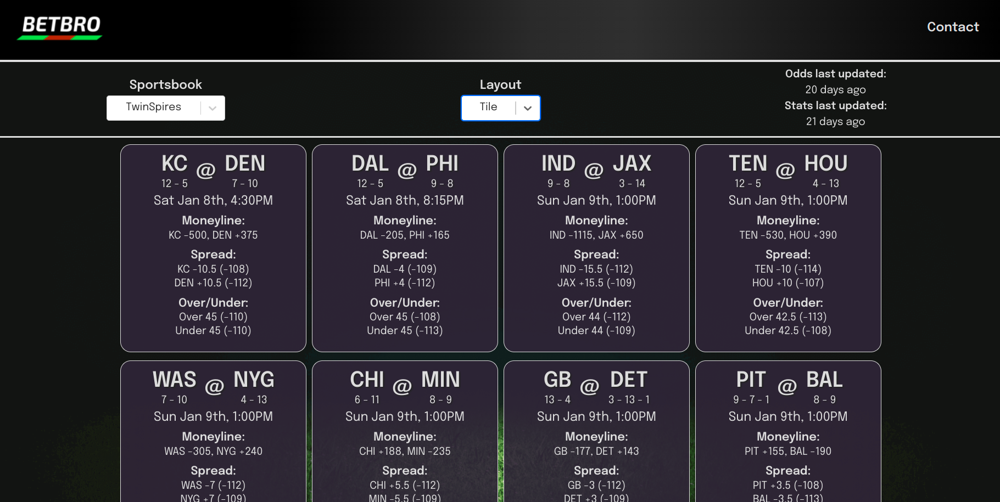

# BetBro

## Link

Live site: https://www.betbro.io

Demo site: https://github.com/fortypercenttitanium/betbro

#

## Screenshots

## Purpose:

I challenged myself to come up with a tool for sports bettors to try to get the edge on the kind of statistical analysis that the pros use. While I don't bet much myself, the prospect of coming up with a tool to help others make intelligent wagers, combined with my love of football, was too much to keep in my head.

## Features:

- View current week NFL matchups and compare team stats against each other.
- Quickly access betting information (spread, over/unders, moneylines) from a multitude of popular bookkeepers updated a few times a day.
- Over 100 different team statistics to compare for each matchup, updated a few times a day.
- Easy-to-read tile mode: click for more details on each matchup.
- Grid-mode for more users who need more information on a spreadsheet-like interface.
- Options such as preferred view mode, selected sportsbook, and stat dropdown selections are saved on change, so your choices are remembered between sessions without any kind of log-in.

## Links:

[Live site](https://www.betbro.io/)

[Demo site](https://bet-bro-testing.netlify.app/)
